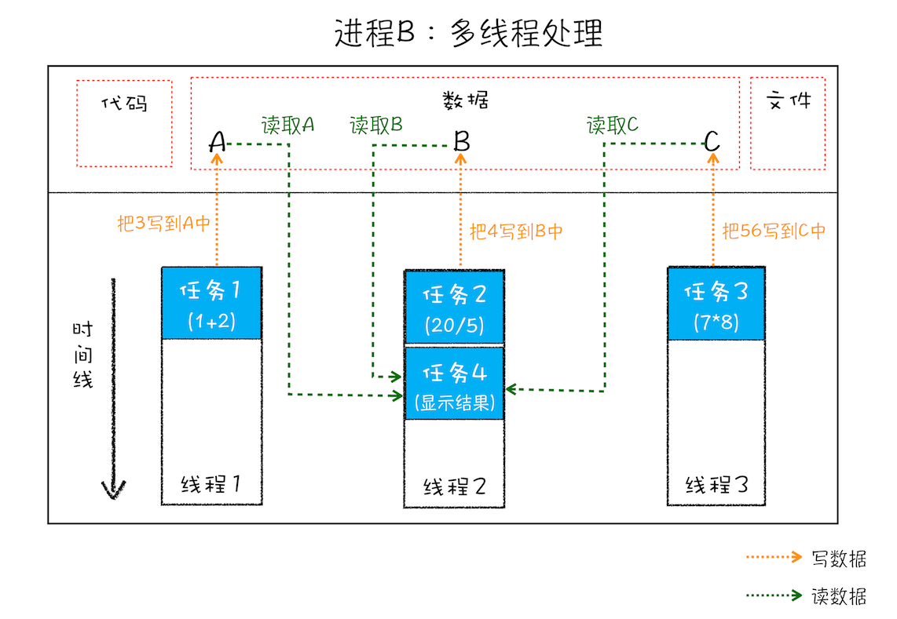
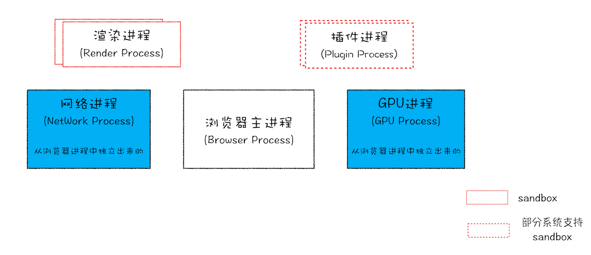

<!--
 * @Description: Chrome架构
-->
### Chrome架构：仅仅打开了1个页面，为什么有4个进程？

#### 1. 进程和线程
__1.1 什么是并行处理__
计算机中的并行处理就是同一时刻处理多个任务，比如我们要计算下面这三个表达式的值，并显示出结果。
```javascript
  A = 1+2
  B = 20/5
  C = 7*8
```
在编写代码的时候，我们可以把这个过程拆分为四个任务：

- 任务 1 是计算 A=1+2；
- 任务 2 是计算 B=20/5；
- 任务 3 是计算 C=7*8；
- 任务 4 是显示最后计算的结果

正常情况下程序可以使用 __单线程__ 来处理，也就是分四步按照顺序分别执行这四个任务。
如果采用 __多线程__，会怎么样呢？我们只需分“两步走”：第一步，使用三个线程同时执行前三个任务；第二步，再执行第四个显示任务。

通过对比分析，你会发现用单线程执行需要四步，而使用多线程只需要两步。因此，__使用并行处理能大大提升性能。__

__1.2 线程__ VS __进程__
多线程可以并行处理任务，但是线程是不能单独存在的，它是由进程来启动和管理的。那什么又是进程呢？
__一个进程就是一个程序的运行实例。__ 详细解释就是，__启动一个程序的时候，操作系统会为该程序创建一块内存，用来存放代码、运行中的数据和一个执行任务的主线程，我们把这样的一个运行环境叫进程。__

为了让你更好地理解上述计算过程，我画了下面这张对比图:


从图中可以看到，__线程是依附于进程的，而进程中使用多线程并行处理能提升运算效率。__
总结来说，进程和线程之间的关系有以下 4 个特点:
__1.2.1 进程中的任意一线程执行出错，都会导致整个进程的崩溃。__
我们可以模拟以下场景：
```
  A = 1+2
  B = 20/0
  C = 7*8
```
我把上述三个表达式稍作修改，在计算 B 的值的时候，我把表达式的分母改成 0，当线程执行到 B = 20/0 时，由于分母为 0，线程会执行出错，这样就会导致整个进程的崩溃，当然另外两个线程执行的结果也没有了。

__1.2.2 线程之间共享进程中的数据。__
如下图所示，线程之间可以对进程的公共数据进行读写操作。



从上图可以看出，线程 1、线程 2、线程 3 分别把执行的结果写入 A、B、C 中，然后线程 2 继续从 A、B、C 中读取数据，用来显示执行结果。

__1.2.3 当一个进程关闭后，操作系统会回收进程所占用的内存。__
当一个进程退出时，操作系统会回收该进程所申请的所有资源；即使其中任意线程因为操作不当导致内存泄漏，当进程退出时，这些内存也会被正确回收。比如之前的 IE 浏览器，支持很多插件，而这些插件很容易导致内存泄漏，这意味着只要浏览器开着，内存占用就有可能会越来越多，但是当关闭浏览器进程时，这些内存就都会被系统回收掉。

__1.2.4 进程之间的内容互相隔离。__
进程隔离是为保护操作系统中进程互不干扰的技术，每一个进程只能访问自己占有的数据，也就避免出现进程 A 写入数据到进程 B 的情况。正是因为进程之间的数据是严格隔离的，所以一个进程如果崩溃了，或者挂起了，是不会影响到其他进程的。如果进程之间需要进行数据的通信，这时候，就需要使用用于进程间通信（IPC）的机制了。

#### 2 单进程浏览器时代
在了解了进程和线程之后，我们再来一起看下单进程浏览器的架构。顾名思义，__单进程浏览器是指浏览器的所有功能模块都是运行在同一个进程里__，这些模块包含了网络、插件、JavaScript 运行环境、渲染引擎和页面等。其实早在 2007 年之前，市面上浏览器都是单进程的。单进程浏览器的架构如下图所示：


如此多的功能模块运行在一个进程里，是导致单进程浏览器 __不稳定、不流畅和不安全__ 的一个主要因素。下面我就来一一分析下出现这些问题的原因。
__问题1：不稳定__
早期浏览器需要借助于 __插件__ 来实现诸如 Web 视频、Web 游戏等各种强大的功能，但是插件是最容易出问题的模块，并且还运行在浏览器进程之中，所以一个插件的意外崩溃会引起整个浏览器的崩溃。
<br>
除了插件之外，__渲染引擎模块__ 也是不稳定的，通常一些复杂的 JavaScript 代码就有可能引起渲染引擎模块的崩溃。和插件一样，渲染引擎的崩溃也会导致整个浏览器的崩溃。

__问题2:不流畅__
从上面的“单进程浏览器架构示意图”可以看出，所有页面的渲染模块、JavaScript 执行环境以及插件都是运行在同一个线程中的，这就意味着同一时刻只能有一个模块可以执行。
比如，下面这个无限循环的脚本：
```javascript
  function freeze() {
    while (1) {
      console.log("freeze");
    }
  }
  freeze();
```
如果让这个脚本运行在一个单进程浏览器的页面里，你感觉会发生什么？
因为这个脚本是无限循环的，所以当其执行时，它会独占整个线程，这样导致其他运行在该线程中的模块就没有机会被执行。因为浏览器中所有的页面都运行在该线程中，所以这些页面都没有机会去执行任务，这样就会导致整个浏览器失去响应，变卡顿。这块内容要继续往深的地方讲就到页面的事件循环系统了，具体相关内容我会在后面的模块中为你深入讲解。

除了上述 __脚本__ 或者 __插件__ 会让单进程浏览器变卡顿外，__页面的内存泄漏__ 也是单进程变慢的一个重要原因。通常浏览器的内核都是非常复杂的，运行一个复杂点的页面再关闭页面，会存在内存不能完全回收的情况，这样导致的问题是使用时间越长，内存占用越高，浏览器会变得越慢。

__问题3：不安全__
这里依然可以从插件和页面脚本两个方面来解释该原因。插件可以使用 C/C++ 等代码编写，通过插件可以获取到操作系统的任意资源，当你在页面运行一个插件时也就意味着这个插件能完全操作你的电脑。如果是个恶意插件，那么它就可以释放病毒、窃取你的账号密码，引发安全性问题。至于页面脚本，它可以通过浏览器的漏洞来获取系统权限，这些脚本获取系统权限之后也可以对你的电脑做一些恶意的事情，同样也会引发安全问题。以上这些就是当时浏览器的特点，不稳定，不流畅，而且不安全。这是一段不堪回首的过去，也许你没有经历过，不过你可以想象一下这样的场景：当你正在用浏览器打开多个页面时，突然某个页面崩溃了或者失去响应，随之而来的是整个浏览器的崩溃或者无响应，然后你发现你给老板写的邮件页面也随之消失了，这时你的心情会不会和页面一样崩溃呢？

#### 3.多进程浏览器时代
好在现代浏览器已经解决了这些问题，是如何解决的呢？这就得聊聊我们这个“多进程浏览器时代”了。

__3.1 早起多进程架构__
你可以先看看下面这张图，这是 2008 年 Chrome 发布时的进程架构。


从图中可以看出，Chrome 的页面是运行在单独的渲染进程中的，同时页面里的插件也是运行在单独的插件进程之中，而进程之间是通过 IPC 机制进行通信（如图中虚线部分）。

__我们先看看如何解决不稳定的问题。__ 由于进程是相互隔离的，所以当一个页面或者插件崩溃时，影响到的仅仅是当前的页面进程或者插件进程，并不会影响到浏览器和其他页面，这就完美地解决了页面或者插件的崩溃会导致整个浏览器崩溃，也就是不稳定的问题。

__接下来再来看看不流畅的问题是如何解决的。__ 同样，JavaScript 也是运行在渲染进程中的，所以即使 JavaScript 阻塞了渲染进程，影响到的也只是当前的渲染页面，而并不会影响浏览器和其他页面，因为其他页面的脚本是运行在它们自己的渲染进程中的。所以当我们再在 Chrome 中运行上面那个死循环的脚本时，没有响应的仅仅是当前的页面。
<br />
对于内存泄漏的解决方法那就更简单了，因为当关闭一个页面时，整个渲染进程也会被关闭，之后该进程所占用的内存都会被系统回收，这样就轻松解决了浏览器页面的内存泄漏问题。
<br />
__最后我们再来看看上面的两个安全问题是怎么解决的。__ 采用多进程架构的额外好处是可以使用 __安全沙箱__，你可以把沙箱看成是操作系统给进程上了一把锁，沙箱里面的程序可以运行，但是不能在你的硬盘上写入任何数据，也不能在敏感位置读取任何数据，例如你的文档和桌面。Chrome 把插件进程和渲染进程锁在沙箱里面，这样即使在渲染进程或者插件进程里面执行了恶意程序，恶意程序也无法突破沙箱去获取系统权限。好了，分析完早期的 Chrome 浏览器后，相信你已经了解了浏览器采用多进程架构的必要性

__3.2 目前多进程架构__
不过 Chrome 的发展是滚滚向前的，相较之前，目前的架构又有了很多新的变化。我们先看看最新的 Chrome 进程架构，你可以参考下图：



从图中可以看出，最新的Chrome浏览器包括：1个浏览器(Browser)主进程、1个GPU进程、一个网络(NetWork)进程、多个渲染进程和多个插件进程。

下面我们来逐个分析下这几个进程的功能。

- __浏览器进程__：主要负责界面显示，用户交互、子进程管理，同时提供给存储等功能。
- __渲染进程__：核心任务是将HTML、CSS和JavaScript引擎V8都是运行在该进程中，默认情况下，Chrome会为每个Tab标签创建一个渲染进程。出于安全考虑，渲染进程都是运行在沙箱模式下。
- __GPU进程__：其实，Chrome刚开始发布的时候是没有GPU进程的。而GPU的使用初衷是为了实现3D CSS的效果，只是随后网页、Chrome 的 UI 界面都选择采用 GPU 来绘制，这使得 GPU 成为浏览器普遍的需求。最后，Chrome 在其多进程架构上也引入了 GPU 进程。
- __网络进程__：主要负责页面的网络资源加载，之前是作为一个模块运行在浏览器进程里面的，直至最近才独立出来，成为一个单独的进程。
- __插件进程__：主要负责插件的运行。因插件易崩溃，所以需要通过插件进程来隔离。以保证插件进程崩溃不会对浏览器和页面造成影响。

讲到这里，现在你应该就可以回答文章开头提到的问题了：仅仅打开了 1 个页面，为什么有 4 个进程？因为打开 1 个页面至少需要 1 个网络进程、1 个浏览器进程、1 个 GPU 进程以及 1 个渲染进程，共 4 个；如果打开的页面有运行插件的话，还需要再加上 1 个插件进程。
<br />
不过凡事都有两面性，虽然多进程模型提升了浏览器的稳定性、流畅性和安全性，但同样不可避免地带来了一些问题：

- __更高的资源占用__：因为每个进程都会包含公共基础结构的副本如（JavaScript 运行环境），这就意味着浏览器会消耗更多的内存资源。
- __更复杂的体系结构__：浏览器各模块之间耦合性高、扩展性差等问题，会导致现在的架构已经很难适应新的需求了。

__3.3 未来面向服务的架构__
为了解决这些问题，在 2016 年，Chrome 官方团队使用“__面向服务的架构__”（Services Oriented Architecture，简称 SOA）的思想设计了新的 Chrome 架构。也就是说 Chrome 整体架构会朝向现代操作系统所采用的“面向服务的架构” 方向发展，原来的各种模块会被重构成独立的服务（Service），每个服务（Service）都可以在独立的进程中运行，访问服务（Service）必须使用定义好的接口，通过 IPC 来通信，从而 __构建一个更内聚、松耦合、易于维护和扩展的系统__，更好实现 Chrome 简单、稳定、高速、安全的目标。

Chrome 最终要把 UI、数据库、文件、设备、网络等模块重构为基础服务，类似操作系统底层服务，下面是 Chrome“面向服务的架构”的进程模型图：


目前 Chrome 正处在老的架构向服务化架构过渡阶段，这将是一个漫长的迭代过程。
<br />
Chrome 正在逐步构建 Chrome 基础服务（Chrome Foundation Service），如果你认为 Chrome 是“便携式操作系统”，那么 Chrome 基础服务便可以被视为该操作系统的“基础”系统服务层。
<br />
同时 Chrome 还提供灵活的弹性架构，在强大性能设备上会以多进程的方式运行基础服务，但是如果在资源受限的设备上（如下图），Chrome 会将很多服务整合到一个进程中，从而节省内存占用。
在资源不足的设备上，将服务合并到浏览器进程中:


