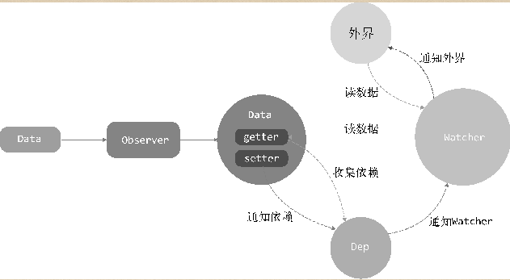

<!--
 * @Description: 变化侦听
 * @version: 1.0
 * @Author: renyong
 * @Date: 2022-05-21 13:35:58
 * @LastEditors: renyong 995151172@qq.com
 * @LastEditTime: 2022-08-13 19:09:03
-->

### 深入 Vue2.0 响应式原理
#### 一.变化侦测

1.1 简介

&nbsp;&nbsp;&nbsp;&nbsp;Vue.js 最独特的特性之一是看起来并不显眼的响应式系统。数据模型仅仅是普通的 JavaScript 对象。而当你修改它们时，视图会进行更新。这使得状态管理非常简单、直接。不过理解其工作原理同样重要，这样你可以回避一些常见的问题。

&nbsp;&nbsp;&nbsp;&nbsp;从状态生成 DOM，再输出到用户界面显示的一整套流程叫作渲染，应用在运行时会不断地进行重新渲染。而响应式系统赋予框架重新渲染的能力，其重要组成部分是变化侦测。变化侦测是响应式系统的核心，没有它，就没有重新渲染。框架在运行时，视图也就无法随着状态的变化而变化。

&nbsp;&nbsp;&nbsp;&nbsp;简单来说,变化侦测的作用是侦测数据的变化。**当数据变化时，会通知视图进行相应的更新**

&nbsp;&nbsp;&nbsp;&nbsp;深入理解变化侦测的工作原理，既可以帮助我们在开发应用时回避一些很常见的问题，也可以在应用程序出问题时，快速调试并修复问题

1.2 什么是变化侦测

&nbsp;&nbsp;&nbsp;&nbsp;Vue.js 的渲染过程是声明式的，我们通过模板来描述状态与 DOM 之间的映射关系。

&nbsp;&nbsp;&nbsp;&nbsp;变化侦测就是用来解决这个问题的，它分为两种类型：一种是“推”（push），另一种是“拉”（pull）。

&nbsp;&nbsp;&nbsp;&nbsp;Angular、React、Vue 变化侦听

- Angular 和 React 都属于"拉",这就是说当状态发生变化时，它不知道哪个状态变了，只知道状态有可能变了，然后会发送一个信号告诉框架，框架内部收到信号后，会进行一个暴力比对来找出哪些 DOM 节点需要重新渲染。这在 Angular 中是脏检查的流程，在 React 中使用的是虚拟 DOM
- **在 vue.js 中属于"推"**，当状态发生变化时，Vue 立刻就知道了，而且在一定程度上知道哪些状态变了。因此，它知道的信息更多，也就可以进行更细粒度的更新。
- 所谓更细粒度的更新，就是说：假如有一个状态绑定着好多个依赖，每个依赖表示一个具体的 DOM 节点，那么当这个状态发生变化时，向这个状态的所有依赖发送通知，让它们进行 DOM 更新操作。相比较而言，“拉”的粒度是最粗的。
- 但是它也有一定的代价，因为粒度越细，每个状态所绑定的依赖就越多，依赖追踪在内存上的开销就会越大。因此，**从 Vue.js 2.0 开始，它引入了虚拟 DOM，将粒度调整为中等粒度，即一个状态所绑定的依赖不再是具体的 DOM 节点，而是一个组件。这样状态变化后，会通知到组件，组件内部再使用虚拟 DOM 进行比对。这可以大大降低依赖数量，从而降低依赖追踪所消耗的内存**。
  Vue.js 之所以能随意调整粒度，本质上还要归功于变化侦测。因为“推”类型的变化侦测可以随意调整粒度。

#### 二.如何追踪变化

**2.1 Object 的变化侦测实现方法**

- 第一种：Object.defineProperty
- 第二种：ES6 的 Proxy（浏览器支持不理想）

**2.2 Object 变化原理底层实现**

- 利用 Object.defineProperty 追踪变化
  ```javascript
  /**
   * @Description:用来对Object.defineProperty进行封装，
   * 其作用就是定义一个响应式数据，在这个函数中进行变化追踪
   * param: data
   * param: key
   * param: val
   * @return {*}
   * @author: renyong
   */
  function defineReactive(data, key, val) {
    Object.defineProperty(data, key, {
      enumerable: true,
      configurable: true,
      get: function () {
        // 每当从data的key中读取数据时，就会触发get
        return val; // 获取值
      },
      set: function (newVal) {
        // 每当往data的key中设置数据时，触发set
        if (val === newVal) return; // 比较新值和旧值相等，则返回
        val = newVal; // 新值和旧值不相等, 新值赋给旧值
      },
    });
  }
  ```
- 如何收集依赖

  思考一下，我们之所以要观察数据，其目的是当数据的属性发生变化时，可以通知那些曾经使用了该数据的地方
  举个例子:

  ```javascript
  <template>
    <h1>{{ name }}</h1>
  </template>
  ```

  该模板中使用了数据 name，所以当它发生变化时，要向使用了它的地方发送通知。
  **注意　在 Vue.js 2.0 中，模板使用数据等同于组件使用数据，所以当数据发生变化时，会将通知发送到组件，然后组件内部再通过虚拟 DOM 重新渲染.**

  总结起来，其实就一句话，**在 getter 中收集依赖，在 setter 中触发依赖。**

- 依赖收集在哪
  现在我们已经有了很明确的目标，就是要在 getter 中收集依赖，那么要把依赖收集到哪里去呢？
  思考一下，首先想到的是 **每个 key 都有一个数组，用来存储当前 key 的依赖**。假设依赖是一个函数，保存在 window.target 上，现在就可以把 defineReactive 函数稍微改造一下：

  ```javascript
  /**
   * @Description:用来对Object.defineProperty进行封装，
   * 其作用就是定义一个响应式数据，在这个函数中进行变化追踪
   * param: data
   * param: key
   * param: val
   * @return {*}
   * @author: renyong
   */
  function defineReactive(data, key, val) {
    let dep = []; // 新增dep容器，用来收集依赖
    Object.defineProperty(data, key, {
      enumerable: true,
      configurable: true,
      get: function () {
        // 每当从data的key中读取数据时，就会触发get
        dep.push(window.target);
        return val; // 获取值
      },
      set: function (newVal) {
        // 每当往data的key中设置数据时，触发set
        if (val === newVal) return; // 比较新值和旧值相等，则返回

        // 新增
        for (let i = 0; i < dep.length; i++) {
          dep[i](newVal, val);
        }
        val = newVal; // 新值和旧值不相等, 新值赋给旧值
      },
    });
  }
  ```

  **这里我们新增了数组 dep，用来存储被收集的依赖**
  **然后在 set 被触发时，循环 dep 以触发收集到的依赖**
  这样写有点耦合，我们 **把依赖收集的代码封装成一个 Dep 类，它专门帮助我们管理依赖。使用这个类，我们可以收集依赖、删除依赖或者向依赖发送通知等**

  ```javascript
  /**
     * @Description: Dep类 我们把依赖收集的代码封装成一个Dep类，
      它专门帮助我们管理依赖。使用这个类，我们可以收集依赖、删除依赖或者向依赖发送通知等
     * @return {*}
     * @author: renyong
     */
  export default class Dep {
    constructor() {
      this.subs = []; // 定义依赖容器，将依赖储存
    }

    addSub(sub) {
      // 添加依赖
      this.subs.push(sub);
    }

    removeSub(sub) {
      // 删除指定依赖
      remove(this.subs, sub);
    }

    depend() {
      // 判断是否有依赖，有则添加,用于Dep实例调用
      if (window.target) {
        this.addSub(window.target);
      }
    }

    notify() {
      // 通知发布
      const subs = this.subs.slice(); // 更简洁语法，用es6 [...this.subs]，或者最好去个重[...new Set(this.subs)]
      for (let i = 0, l = subs.length; i < l; i++) {
        subs[i].update(); // 通知Watcher更新
      }
    }
  }

  function remove(arr, item) {
    if (arr.length) {
      // 方式一，vue源码写法 利用indexOf()
      const index = arr.indexOf(item);
      if (index > -1) return arr.splice(index, 1);

      // 方式二 最好利用findIndex(),弥补indexOf()方法的缺陷,indexOf(NaN) 会返回 -1
      const index = arr.findIndex((v) => v == item);
      if (~index) return arr.splice(index, 1); // ~相当于-(index + 1)
    }
  }
  ```

  之后再改造一下 defineReactive：

  ```javascript
  /**
   * @Description:用来对Object.defineProperty进行封装，
   * 其作用就是定义一个响应式数据，在这个函数中进行变化追踪
   * param: data
   * param: key
   * param: val
   * @return {*}
   * @author: renyong
   */
  function defineReactive(data, key, val) {
    let dep = new Dep(); // 新增
    Object.defineProperty(data, key, {
      enumerable: true,
      configurable: true,
      get: function () {
        // 每当从data的key中读取数据时，就会触发get
        dep.depend(); // 新增
        return val; // 获取值
      },
      set: function (newVal) {
        // 每当往data的key中设置数据时，触发set
        if (val === newVal) return; // 比较新值和旧值相等，则返回
        val = newVal; // 新值和旧值不相等, 新值赋给旧值
        dep.notify(); // 新增
      },
    });
  }
  ```

- 依赖是谁
  在上面的代码中，我们收集的依赖是 window.target，那么它到底是什么？我们究竟要收集谁呢？
  收集谁，换句话说，就是 **当属性发生变化后，通知谁**。
  **我们要通知用到数据的地方，而使用这个数据的地方有很多，而且类型还不一样，既有可能是模板，也有可能是用户写的一个 watch，这时需要抽象出一个能集中处理这些情况的类。然后，我们在依赖收集阶段只收集这个封装好的类的实例进来，通知也只通知它一个。接着，它再负责通知其他地方。所以，我们要抽象的这个东西需要先起一个好听的名字。嗯，就叫它 Watcher 吧**
- 什么是 Watcher
  **Watcher 是一个中介的角色，数据发生变化时通知它，然后它再通知其他地方**

  ```javascript
  // keyPath - 属性路径
  vm.$watch("a.b.c", function (newVal, oldVal) {
    // 做点什么
  });
  ```

  这段代码表示当 data.a.b.c 属性变化时，触发第二个参数中的函数
  思考一下，怎么实现这个功能呢？好像只要把这个 watcher 实例添加到 data.a.b.c 属性的 Dep 中就行了。然后，当 data.a.b.c 的值发生变化时，通知 Watcher。接着，Watcher 再执行参数中的这个回调函数

  ```javascript
  export default class Watcher {
    constructor(vm, expOrFn, cb) {
      this.vm = vm;
      this.getter = parsePath(expOrFn);
      this.cb = cb;
      this.value = this.get();
    }

    get() {
      // 用来触发依赖收集并获取keyPath的值
      window.target = this; // Dep当中会收集这个this
      let value = this.getter.call(this.vm, this.vm); // 执行this.getter(), 就可以读取data.a.b.c的值
      window.target = undefined; // 收集完毕置为undefined, 因为下次Watcher监听到的依赖可能不一样
      return value;
    }

    update() {
      // 用于Dep中循环收集到的依赖列表，触发Watcher中的update
      const oldValue = this.value;
      this.value = this.get();
      this.cb.call(this.vm, this.value, oldValue); // 传入新值和旧值，并执行回调函数
    }
  }
  ```

  这段代码可以把自己主动添加到 data.a.b.c 的 Dep 中去，是不是很神奇？
  因为我 **在 get 方法中先把 window.target 设置成了 this,也就是当前 Watcher 的实例,然后我再读一下 data.a.b.c 的值，这肯定会触发 getter**
  **触发了 getter,就会触发依赖收集逻辑，就会在 window.target 当中读取一个依赖添加到 Dep 中**
  **这就导致，只要现在 window.target 赋一个 this,然后再读一下值，去触发 getter,就可以把 this**
  **主动添加到 keyPath 的 Dep 中**，有没有觉得很神奇？
  **依赖注入到 Dep 中后，每当 data.a.b.c 的值发生变化时，就会让依赖列表中所有依赖循环触发 update 方法，也就是 Watcher 中的 update 方法，而 update 方法会执行参数中的回调函数，将 value 和 oldValue 传入参数中**
  **所以，其实不管是用户执行的 vm.$watch('a.b.c', (value, oldValue)=>{}),还是模板中用到的 data,都是通过 Watcher 来通知自己是否需要发生变化**
  那么 parsePath 是怎么读取一个字符串的 keyPath 的呢，其原理如下：

  ```javascript
  /**
    * @Description: 解析简单路径
      param path
    * @return {*}
    * @author: renyong
    */
  const bailRE = /[^\w.$]/;
  export function parsePath(path) {
    if (bailRE.test(path)) return;
    const segments = path.split("."); // path 对应实参 a.b.c
    return function (obj) {
      // obj 对应实参 this.vm
      for (let i = 0; i < segments.length; i++) {
        if (!obj) return;
        obj = obj[segments[i]]; 
      }
    };        
    return obj;
  }
  ```

  先将 keypath 用 . 分割成数组，然后循环数组一层一层去读数据，最后拿到的 obj 就是 keypath 中想要读的数据

- 递归侦测所有 key
  现在，其实已经可以实现变化侦测的功能了，但是前面介绍的只能侦测数据中的某一个属性，我们希望 **把数据中的所有属性（包括子属性）都侦测到，所以要封装一个 Obersever 类。这个类的作用是将一个数据内的所有属性（包括子属性）都转换成 getter/setter 的形式，然后去追踪它们的变化**

  ```javascript
  /*
      Observer类会附加到每一个被侦测的Object上
      一旦被附加上，Observer会将object的所有属性转换为getter/setter的形式
      来收集属性的依赖，并且当属性发生变化时会通知这些依赖
    */
  export class Observer {
    constructor(value) {
      this.value = value;

      if (!Array.isArray(value)) {
        this.walk(value);
      }
    }
    /* 
        walk会将每个属性都转换成getter/setter的形式来侦测变化
        这个方法只有在数据类型为Object时被调用
       */
    walk(obj) {
      // 注意，这里建议不要用for...in去添加key,for...in会遍历原型链上的非Symbol属性，导致不必要的开销
      const keys = Object.keys(obj);
      for (let i = 0; i < keys.length; i++) {
        defineReactive(obj, keys[i], obj[keys[i]]);
      }
    }
  }

  function defineReactive(data, key, val) {
    // 新增，递归子属性
    if (typeof val === "object") new Observer(val); // 创建一个观察者对象实例
    let dep = new Dep();
    Object.defineProperty(data, key, {
      enumerable: true,
      configurable: true,
      get: function () {
        dep.depend();
        return val;
      },
      set: function (newVal) {
        if (val === newVal) return;
        val = newVal;
        dep.notify();
      },
    });
  }
  ```

  **我们定义了 Observer 类，它用来将一个正常的 object 转换成被侦测的 object**
  **然后判断数据类型， 只有 Object 类型的数据才会调用 walk 将每一个属性转换成 getter/setter 的形式来侦测变化**
  **最后，在 defineReactive 中新增 new Observer(val)来递归子属性，这样我们就可以把 data 中的所有属性（包括子属性）都转换成 getter/setter 的形式来侦测变化**
  **当 data 中的属性发生变化时，与这个属性对应的依赖就会接受到通知**
  也就是说，我们只要将一个 object 传到 Observer 中，那么这个 object 就会变成响应式的 object

- 关于 Object 的问题
  我们了解了数据变化是通过 getter/setter 来追踪的，也正是由于这种追踪方式，有些语法找那个即便是数据发生了变化，Vue.js 也追踪不到
  比如，向 object **添加一个属性**：

  ```javascript
  var vm = new Vue({
    el: "#el",
    template: `#demo-template`,
    methods: {
      action() {
        this.obj.name = "renyong";
      },
    },
    data: {
      obj: {},
    },
  });
  ```

  在 action 方法中，我们在 obj 上面新增了 name 属性，Vue.js 无法侦测这个变化，所以不会向依赖发送通知
  再比如， 从 obj 中 **删除一个属性**：

  ```javascript
  var vm = new Vue({
    el: "#el",
    template: `#demo-template`,
    methods: {
      action() {
        delete this.obj.name;
      },
    },
    data: {
      obj: {
        name: "renyong",
      },
    },
  });
  ```

  在 action 方法中删除了 obj 中的 name 属性，而 Vue.js 无法侦测到这个变化，所以不会向依赖发送通知
  **Vue.js 通过 Object.defineProperty 来将对象的 key 转换成 getter/setter 的形式来追踪变化，但是 getter/setter 只能追踪一个数据是否被修改，无法追踪新增属性和删除属性，所以会有上面的问题**

  这也是没有办法的事，因为 **在 es6 之前，javascript 没有提供元编程的能力，即对编程语言进行编程，所以无法侦测到一个新属性被添加到对象中，也无法侦测到一个属性从对象中删除了，为了解决这个问题，Vue.js 提供了两个 API，vm.\$set 与 vm.\$delete**

**2.3 总结**

- 下面是 Data、Observer、Dep 和 Watcher 之间的关系
  
- 变化侦测就是侦测数据的变化。当数据发生变化时，要能侦测到并发出通知
- Object 可以通过 Object.defineProperty 将属性转换成 getter/setter 的形式来追踪变化。读取数据时触发 getter, 修改数据时出发 setter
- 我们需要在 getter 中收集哪些依赖使用了数据。当 setter 被触发时，去通知 getter 中收集的依赖数据发生了变化
- 收集依赖需要为依赖找一个存储依赖的地方，为此我们创建了 Dep,它是用来收集依赖、删除依赖和向依赖发送消息等
- **所以依赖，其实就是 Watcher，只有 Watcher 触发的 getter 才会收集依赖，哪个 Watcher 触发了 getter,就把哪个 Watcher 收集到 Dep 中，当数据发生变化时，会循环依赖列表，把所有 Watcher 都通知一遍**
- **Watcher 的原理是先把自己设置到全局唯一的指定位置(window.target),然后读取数据，因为读取了数据，所以会触发这个数据的 getter。接着，在 getter 中就会从全局唯一的那个位置读取当前正在读取数据的 Watcher,并把这个 Watcher 收集到 Dep 中去。通过这样的形式，Watcher 可以主动去订阅任意一个数据的变化**
- **我们还创建了 Observer 类，它的作用是把一个 object 中的所有数据（子数据）都转换成响应式，它就会侦测 object 中（子数据）所有数据的变化**
- 由于 es6 之前 javascript 并没有提供元编程能力，所以在对象上新增属性和删除属性都无法追踪到
