### CommonJS 规范

CommonJS 对模块的定义十分简单，主要分为模块引用、模块定义和模块标识 3 个部分。

CommonJS 的出发点

后端 js 的规范落后，规范依然薄弱，还有以下缺陷：

- 没有模块系统
- 标准库少
- 没有标准接口
- 缺乏包管理系统

CommonJS 规范的提出，主要是为了弥补当前 js 没有标准的缺陷，可以具备跨宿主环境执行的能力，不仅可以利用 js 开发客户端应用，而且还可以编写以下应用。

- 服务器端 js 应用程序
- 命令行工具
- 桌面图形界面引用程序
- 混合应用

