### 核心模块

node 的核心模块在编译成可执行文件的过程中被编译进了二进制文件。核心模块其实分为 c/c++编写的和 js 编写的两部分。其中 c/c++文件存放在 node 项目的 src 目录下，js 文件存放在 lib 目录下。

1. js 核心模块的编译过程

在编译所有 c/c++文件之前，编译程序需要将所有的 js 模块文件编译为 c/c++代码，此时是否直接将其编译为可执行代码了呢？其实不是。

1.1 转存为 c/c++代码
node 采用了 v8 附带的 js2c.py 工具，将所有内置的 js 代码(src/node.js 和 lib/\*.js)转换成 c++里的数组，生成 node_natives.h 头文件。相关代码如下：

```js
  namespace node {
    const char node_native[] = { 47, 47, ..};
    const char dgram_native[] = { 47, 47, ..};
    const char console_native[] = { 47, 47, ..};
    const char buffer_native[] = { 47, 47, ..};
    const char querystring_native[] = { 47, 47, ..};
    const char punycode_native[] = { 47, 42, ..};
    ...
    struct _native {
      const char* name;
      const char* source;
      size_t source_len;
    };
    static const struct _native natives[] = {
      { "node", node_native, sizeof(node_native)-1 },
      { "dgram", dgram_native, sizeof(dgram_native)-1 },
    ...
    };
  }
```

在这个过程中，js 代码以字符串的形式存储在 node 命名空间中，是不可直接执行的。在启动 node 进程中，js 代码直接加载进内存中。在加载的过程中，js 核心模块经历标识符分析后直接定位到内存中，比普通的文件模块从磁盘中一处一处查找要快很多。

1.2 编译 js 核心模块

lib 目录下的所有模块文件也没有定义 require、module、exports 这些变量。在引入 js 核心模块的过程中，也经历了头尾包装的过程，然后才执行和导出了 exports 对象。与文件模块有区别的地方在于：获取源代码的方式(核心模块时从内存中加载的)以及缓存执行结果的位置。

js 核心模块的定义如下面的代码所示，源文件通过 process.binding('natives')取出。编译成功的模块缓存到 NativeModule.\_cache 对象上， 文件模块则缓存到 Module.\_cache 对象上：

```js
function NativeModule(id) {
  this.filename = id + ".js";
  this.id = id;
  this.exports = {};
  this.loaded = false;
}
NativeModule._source = process.binding("natives");
NativeModule._cache = {};
```

2. c/c++核心模块的编译过程

在核心模块中，有些模块全部有 c/c++编写的，有些模块则由 c/c++完成核心部分，其他部分则由 js 实现包装或向外导出，以满足性能需求。后面这种 c++模块主内完成核心，js 主外实现封装的模式是 node 能够提高性能的常见方式。通常脚本语言的开发速度优于静态语言，但是其性能则弱于静态语言，而 node 的这种复合模式可以在开发速度和性能之间找到平衡点。

将那些由纯 c/c++编写的部分统一称为内建模块，因为它们通常不被用户直接调用。node 的 buffer、crypto、evals、fs、os 等模块都是部分通过 c/c++编写的。

2.1 内建模块的组织形式

在 node 中，内建模块的内部结构定义如下：

```c++
struct node_module_struct {
  int version;
  void *dso_handle;
  const char *filename;
  void (*register_func) (v8::Handle<v8::Object> target);
  const char *modname;
};
```

每一个内建模块在定义之后，都通过 NODE_MODULE 宏将模块定义到 node 命名空间中，模块的具体初始化方法挂载为结构的 register_func 成员：

```js
#define NODE_MODULE(modname, regfunc)
  extern "C" {
  NODE_MODULE_EXPORT node::node_module_struct modname ## _module =
  {
    NODE_STANDARD_MODULE_STUFF,
    regfunc,
    NODE_STRINGIFY(modname)
  };
}
```

node_extension.h 文件将这些散列的内建模块统一放进了一个叫 node_module_list 的数组中，这些模块有：

- node_buffer
- node_crypto
- node_evals
- node_fs
- node_http_parser
- node_os
- node_zlib
- node_timer_wrap
- node_tcp_wrap
- node_udp_wrap
- node_pipe_wrap
- node_cares_wrap
- node_tty_wrap
- node_process_wrap
- node_fs_event_wrap
- node_signal_watcher

这些内建模块的取出也十分简单。Node 提供了 get_builtin_module()方法从 node_module_list 数组中取出这些模块。

内建模块的优势在于：**首先，它们本身由 c/c++编写，性能上优于脚本语言；其次，在进行文件编译时，它们被编译进二进制文件。一旦 node 开始执行，它们被直接加载进内存中，无需再次做标识符定位、文件定位、编译等过程，直接就可执行。**

2.2 内建模块的导出

在 node 的所有模块类型中，存在着如下图的一种依赖层级关系，即文件模块可能会依赖核心模块，核心模块可能会依赖内建模块。



通常，不推荐文件模块直接调用内建模块。如需调用，直接调用核心模块即可，因为核心模块中基本都封装了内建模块。那么内建模块是如何将内部变量或方法导出，以供外部 js 核心模块调用的呢？

Node 在启动时，会生成一个全局变量 process,并提供 Binding()方法来协助加载内建模块。Binding()的实现代码在 src/node.cc 中，具体如下所示：

```js
static Handle<Value> Binding(const Arguments & args) {
 HandleScope scope;
 Local<String> module = args[0]->ToString();
 String::Utf8Value module_v(module);
 node_module_struct* modp;
 if (binding_cache.IsEmpty()) {
 binding_cache = Persistent<Object>::New(Object::New());
 }
 Local<Object> exports;
 if (binding_cache->Has(module)) {
 exports = binding_cache->Get(module)->ToObject();
 return scope.Close(exports);
 }
 // Append a string to process.moduleLoadList
 char buf[1024];
 snprintf(buf, 1024, "Binding %s", *module_v); %
 uint32_t l = module_load_list->Length();
 module_load_list->Set(l, String::New(buf));
 if ((modp = get_builtin_module(*module_v)) != NULL) {
 exports = Object::New();
 modp->register_func(exports);
 binding_cache->Set(module, exports);
 } else if (!strcmp(*module_v, "constants")) {
 exports = Object::New();
 DefineConstants(exports);
 binding_cache->Set(module, exports);
#ifdef __POSIX__
 } else if (!strcmp(*module_v, "io_watcher")) {
 exports = Object::New();
 IOWatcher::Initialize(exports);
 binding_cache->Set(module, exports);
#endif
 } else if (!strcmp(*module_v, "natives")) {
 exports = Object::New();
 DefineJavaScript(exports);
 binding_cache->Set(module, exports);
 } else {
 return ThrowException(Exception::Error(String::New("No such module")));
 }
 return scope.Close(exports);
}
```

在加载内建模块时，我们先创建一个 exports 空对象，然后调用 get_builtin_module()方法获取内建模块对象，通过执行 register_func()填充 exports 对象，最后将 exports 对象按模块名缓存，并返回给调用方完成导出。

这个方法不仅可以导出内建方法，还能导出一些别的内容。前面提到的 js 核心文件被转换为 c/c++数组存储后，便是通过 process.binding('natives')取出放置在 NativeModule_source 中的:

```js
NativeModule._source = process.binding("natives");
```

该方法将通过 js2c.py 工具转换出的字符串数组取出，然后重新转换为普通字符串，以对 js 核心模型进行编译和执行。

3 核心模块的引入流程

前面讲述了核心模块的原理，也解释了核心模块的引入速度为何是最快的。
从图所示的 os 原生模块的引入流程可以看到，为了符合 CommonJS 模块规范，从 js 到 c/c++的过程是相当复杂的，它要经历 c/c++层面的内建模块定义、js 核心模块的定义和引入以及 js 文件模块层面的引入。但是对于用户而言，require()十分简洁、友好。



4 编写核心模块

下面我们以 c/c++模块为例演示如何编写内建模块。为了便于理解，我们先编写一个及其简单的 js 版本的原型，这个方法返回一个 Hello world！字符串：

```js
exports.sayHello = function () {
  return "Hello world!";
};
```

编写内建模块通常分两步完成：编写头文件和编写 c/c++文件。

(1).将以下代码保存为 node_hello.h，存放到 Node 的 src 目录下：

```js
  #ifndef NODE_HELLO_H_
  #define NODE_HELLO_H_
  #include <v8.h>
  namespace node {
  // 预定义方法
  v8::Handle<v8::Value> SayHello(const v8::Arguments& args);
  }
  #endif
```

(2). 编写 node_hello.cc，并存储到 src 目录下：

```js
#include <node.h>
#include <node_hello.h>
#include <v8.h>
namespace node {
using namespace v8;
// 实现预定义的方法
Handle<Value> SayHello(const Arguments& args) {
 HandleScope scope;
 return scope.Close(String::New("Hello world!"));
}
// 给传入的目标对象添加sayHello方法
void Init_Hello(Handle<Object> target) {
 target->Set(String::NewSymbol("sayHello"), FunctionTemplate::New(SayHello)->GetFunction());
}
}
// 调用NODE_MODULE()将注册方法定义到内存中
NODE_MODULE(node_hello, node::Init_Hello)
```

以上两步完成了内建模块的编写，但是真正要让 node 认为它是内建模块，还需要更改 src/node_extensions.h,
在 NODE_EXT_LIST_END 前添加 NODE_EXT_LIST_ITEM(node_hello)，以将 node_hello 模块添加进 node_module_list 数组中。

其次，还需要让编写的两份代码编译进执行文件，同时需要更改 node 的项目生成文件 node.gyp，并在’target_name‘: 'node'节点的 sources 中添加上新编写的两个文件。然后编译整个 node 项目。

编译和安装后，直接在命令行中运行以下代码，将会得到期望的效果：

```js
  $ node
  > var hello = process.binding('hello');
  undefined
  > hello.sayHello();
  'Hello world!'
  >
```
