#### 模块机制

1. 在 node 中引入模块，需要经历如下 3 个步骤：

- 路径分析
- 文件定位
- 编译执行

在 Node 中，模块分为两类：一类是 Node 提供的模块，也叫核心模块；另一类是用户编写的模块，叫作文件模块。

- 核心模块部分在 node 源代码的编译过程中，编译进了二进制执行文件。在 node 进程启动时，部分核心模块就被直接加载进内存中，所以这部分核心模块引入时，文件定位和编译执行这两个步骤可以省略掉，并且在路径分析中优先判断，所以它的加载速度是最快的。

2. 优先从缓存加载

- 与前端浏览器会缓存静态脚本文件以提高性能一样，node 对引入过的模块都会进行缓存，以减少二次引入时的开销。不同的地方在于，浏览器仅仅缓存文件，而 node 缓存的是编译和执行之后的对象。
- 无论是核心模块还是文件模块，require()方法对相同模块的二次加载都一律采用缓存优先的方式，这是第一优先级的。不同之处在于核心模块的缓存检查先于文件模块的缓存检查。

       2.1 路径分析和文件定位

       因为标识符有几种形式，对于不同的标识符，模块的查找和定位有不同程度上的差异。

       1. 模块标识符分析
       - 核心模块、如http、fs、path等。
       - .或..开始的相对路径文件模块。
       - 以/开始的绝对路径文件模块。
       - 非路径形式的文件模块，如自定义的connect模块。)

       - 核心模块：优先级仅次于缓存加载
       - 路径形式的文件模块：以.或者..和/开始的标识符，require()方法会将路径转为真实路径，并以真实路径作为索引，将编译执行后的结果存放到缓存中，以使二次加载时更快。其加载速度慢于核心模块。
       - 自定义模块：查找时最费时的，也是所有方式中最慢的一种。

      2.2 文件定位

       从缓存加载的优化策略使得二次引入时不需要路径分析、文件定位和编译执行的过程，大大提高了再次加载模块时的效率。但在文件的定位过程中，还有一些细节需要注意，这主要包括文件扩展名的分析，目录和包的处理。

       - 文件扩展名分析

       require()在分析标识符的过程中，会出现标识符中不包含文件扩展名的情况。CommonJs模块规范也允许在标识符中不包含文件扩展名，这种情况下，node会按.js、.json和.node的次序补足扩展名，依次尝试。

       在尝试过程中，需要调用fs模块同步阻塞式地判断文件是否存在。因为node是单线程的，所以这里是一个会引起性能问题的地方。小诀窍是：如果是.node和.json文件，在传递给require()的标识符中带上扩展名，会加快一点速度。另一个诀窍是：同步配合缓存，可以大幅度缓解node单线程中阻塞式调用的缺陷。

       - 目录分析和包
      在分析标识符的过程中，require()通过分析文件扩展名之后，可能没有查找到对应文件，但却得到一个目录，这在引入自定义模块和逐个模块路径进行查找时经常会出现，此时Node会将目录当做一个包来处理。
      在这个过程中，Node对CommonJS包规范进行了一定程度的支持。首先，Node在当前目录下查找package.json，通过JSON.parse()解析包描述对应，从中取出main属性指定的文件名进行定位。如果文件名缺少扩展名，将会进入扩展名分析步骤。

       而如果main属性指定的文件名错误，或者压根没有package.json文件，Node会将index当做默认文件名。

node 标识符分类如下：



node 模块分类如下：


node 文件定位如下：


2.2.3 模块编译
在 Node 中，每个文件模块都是一个对象，它的定义如下：

```js
function Module(id, parent) {
  this.id = id;
  this.exports = {};
  this.parent = parent;
  if (parent && parent.children) {
    parent.children.push(this);
  }
  this.filename = null;
  this.loaded = false;
  this.children = [];
}
```

编译和执行时引入文件模块的最后一个阶段。定位到具体文件后，Node 会新建一个模块对象，然后根据路径载入并编译。

- .js 文件：通过 fs 模块同步读取文件后编译执行。
- .node 文件：这是用 c/c++编写的扩展文件，通过 dlopen()方法加载最后编译生成的文件。
- .json 文件：通过 fs 模块同步读取文件后，用 JSON.parse()解析返回结果。
- 其余扩展名文件：他们都被当做.js 文件载入。

  每一个编译成功的模块都会将其文件路径作为索引缓存在 Module.\_cache 对象上，以提高二次引入的性能。

  根据不同的文件扩展名，node 会调用不同的读取方式，如.json 文件的调用如下：

  ```js
  // Native extension for .json
  Module._extensions[".json"] = function (module, filename) {
    var content = NativeModule.require("fs").readFileSync(filename, "utf-8");
    try {
      module.exports = JSON.parse(stripBOM(content));
    } catch (err) {
      err.message = filename + "：" + err.message;
      throw err;
    }
  };
  ```

其中， Module.\_extensions 会被赋值给 require()的 extensions 属性，所以通过代码中访问 require.extensions 可以知道系统中已有的扩展加载方式，编写测试下：

```js
console.log(require.extensions);
```

得到的执行结果如下：

```js
       {
              '.js': [Function],
              '.json': [Function],
              '.node': [Function]
       }
```

如果想对自定义的扩展名进行特殊的加载，可以通过类似 require.extensions['.ext']的方式实现。早期 CoffeeScript 文件就是通过添加 require.extensions['.coffee']扩展的方式来实现加载的。但是从 v0.10.6 版本开始，官方不鼓励通过这种方式来进行自定义扩展名的加载，而是 **期望先将其他语言或文件编译成 js 文件后再加载，这样做的好处在于不将繁琐的编译加载等过程引入 node 的执行过程中。**

确定文件的扩展名之后，node 将调用具体的编译方式来将文件执行后返回给调用者。

1. js 模块的编译

回到 CommonJS 模块规范，我们知道每个模块文件中存在着 require、exports、module 这个 3 个变量，但是它们在模块文件中并没有定义，那么从何而来？甚至在 node 的 api 文档中，我们知道每个模块中还有**filename、**dirname 这两个变量的存在，它们又是从何而来？如果我们把直接定义模块的过程放在浏览器端，会存在污染全局变量的情况。

事实上，**在编译过程中，node 对获取的 js 文件内容进行了头尾包装。在头部添加了(function(exports, require, module, \_\_filename, \_\_dirname)\{\n, 在尾部添加了\n});** 一个正常的 js 文件会被包装成如下样子：

```js
(function (exports, require, module, __filename, __dirname) {
  var math = require("math");
  exports.area = function (radius) {
    return Math.PI * radius * radius;
  };
});
```

这样每个模块文件之间都进行了作用域隔离。包装之后的代码会通过 vm 原生模块的 runInThisContext()方法执行(类似 eval, 只是具有明确上下文，不污染全局)，返回一个具体的 function 对象。最后，将当前模块对象的 exports 属性、require()方法、module(模块对象本身)、以及在文件定位中得到的完整文件路径和文件目录作为参数传递给这个 function()执行。

这就是这些变量并没有定义在每个模块文件中却存在的原因。在执行之后，模块的 exports 属性被返回给了调用方。exports 属性上的任何方法和属性都可以被外部调用到，但是模块中的其余变量或属性则不可直接被调用。

此外，在存在 exports 的情况下，还存在 module.exports。理想情况下，只要赋值给 exports 即可:

```js
exports = function () {
  // My Class
};
```

但是通常都会得到一个失败的结果。其原因在于，exports 对象是通过形参的方式传入的，直接赋值形参会改变形参的引用，但并不能改变作用域外的值。测试代码如下：

```js
var change = function (a) {
  a = 100;
  console.log(a);
};
var a = 10;
change(a);
console.log(a); // => 10
```

如果要达到 require 引入一个类的效果，请赋值给 module.exports 对象。这个迂回的方案不改变形参的引用。
